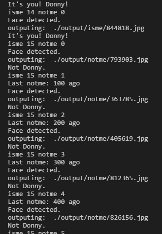
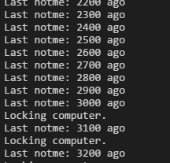
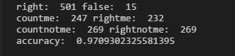

# FaceLock  
Recognize your face, lock your computer when you are absent or when others appear.  

## Go through  
When you leave your computer, FaceLock lost track of you.  
When somebody else come into the vesion of your computer, and last for sometime, FaceLock will begin to count down.  
  
When count down to MaxFailDelay, FaceLock lock your computer automatically.  
  

## Accuracy  
The valid result is as follow. Please be aware that it's just test with limit cases and may be different vary to images inputted.  
  
However, so far, FaceLock has never mistake others for me during my test after I add some layers and increase epoch. Although sometimes it might fail to recognize me if I make faces.  
Please let me know if in your case FaceLock happens to mistake someone else for you.  

## Requirements  
* Python3.5  
* Windows 10  
* WebCamera  
* Lots of images of you and others  
Put the training images to [data/train/me](./data/train/me) and [data/train/other](./data/train/other).  
Put the validation images to [data/valid/me](./data/valid/me) and [data/valid/other](./data/valid/other).  
In case you are puzzled about how much images will be enought, I am using about 160 images of myself and 290 images of others.  

## Preparation  
Install Tensorflow, Keras, OpenCV.  
```  
> pip install tensorflow  
> pip install keras  
> pip install opencv-python  
```  
Remember to use tensorflow backend for keras (instead of Theano).  

## Usage  
First of all, train the network.  
```  
> python train.py  
```  
  
Then, validate the network.  
```  
> python valid.py  
```  
  
Finally, start FaceLock.  
```  
> python main.py  
```  

## Special Thanks  
Thank to the inspiration from [Hironsan](https://github.com/Hironsan), whose project [BossSensor](https://github.com/Hironsan/BossSensor) inspires me a lot, and lead to the birth of my FaceLock project.  

## Licence  
[MIT Licence](./LICENSE)  

## Author  
[Donny-Hikari](https://github.com/Donny-Hikari)  